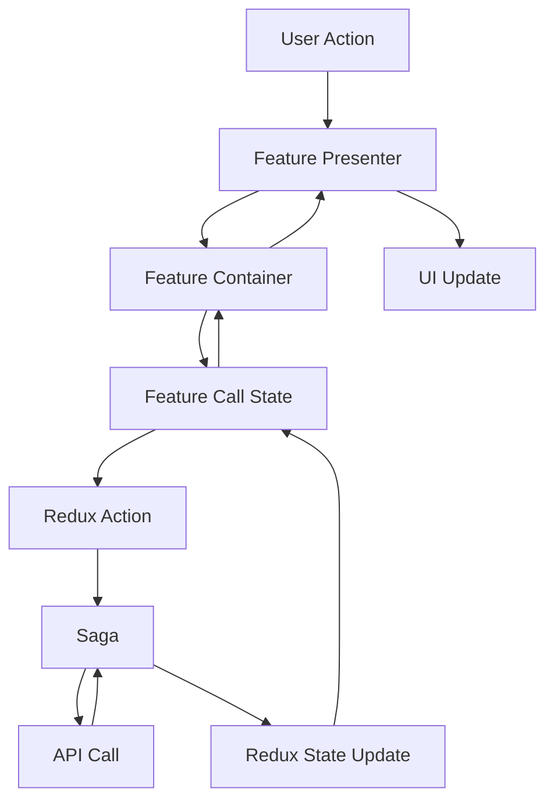

# 🏗️ Architecture Documentation

## 📋 Overview

This project implements a **Self-Contained Feature Architecture** that promotes modularity, maintainability, and scalability. Each feature is a complete, independent module that can function on its own.

## 🎯 Architecture Principles

### 1. **Self-Contained Features**
Each feature contains everything it needs:
- UI Components (containers, presenters)
- Business Logic (Redux slice, sagas)
- Type Definitions (TypeScript interfaces)
- Styling (SCSS modules)
- State Management (call states)

### 2. **Domain-Driven Structure**
Features are organized by business domains:
```
features/
├── auth/           # Authentication domain
│   ├── login/      # Login feature
│   └── register/   # Register feature (planned)
├── user/           # User management domain
│   └── profile/    # Profile feature (planned)
└── shop/           # Shopping domain
    ├── catalog/    # Product catalog (planned)
    └── cart/       # Shopping cart (planned)
```

### 3. **Clear Separation of Concerns**
- **App Router**: Only routing logic
- **Features**: Complete business functionality
- **Global Store**: Feature coordination
- **Hooks**: Reusable logic abstraction
- **Services**: External integrations

## 📁 Detailed Structure

### Feature Module Structure
```
features/[domain]/[feature]/
├── containers/              # 🧠 Smart Components
│   └── FeatureContainer.tsx # Business logic, state management
├── components/              # 🎨 Dumb Components  
│   └── FeaturePresenter.tsx # Pure UI, no business logic
├── states/                  # 🔄 State Management
│   └── FeatureCallState.tsx # Redux connection layer
├── redux/                   # 🏪 Redux Logic
│   ├── featureSlice.ts     # Actions, reducers, selectors
│   └── featureSaga.ts      # Side effects, API calls
├── types/                   # 📝 Type Definitions
│   └── feature.types.ts    # Feature-specific types
├── styles/                  # 🎨 Styling
│   └── feature.module.scss # Feature-specific styles
└── index.ts                # 📦 Barrel Exports
```

### Component Hierarchy
```
Page Component (app/)
    ↓
Feature Container (containers/)
    ↓
Feature Call State (states/)
    ↓
Feature Presenter (components/)
    ↓
UI Elements
```

## 🔄 Data Flow

### 1. **User Interaction Flow**


### 2. **State Management Flow**
```
User Input → Container → Call State → Redux Action → Saga → API → State Update → UI
```

## 🧩 Feature Implementation Guide

### 1. **Container Component**
Smart component that handles business logic:
```typescript
// containers/LoginContainer.tsx
export const LoginContainer: React.FC<LoginContainerProps> = ({
  onLoginSuccess,
  onLoginError,
  redirectTo = '/',
}) => {
  const [formData, setFormData] = useState<LoginFormData>({
    email: '',
    password: '',
    rememberMe: false,
  });

  return (
    <LoginCallState>
      {({ user, isLoading, error, login, logout, clearError }) => (
        <LoginPresenter
          user={user}
          isLoading={isLoading}
          error={error}
          formData={formData}
          onFormDataChange={setFormData}
          onSubmit={login}
          onClearError={clearError}
          onLogout={logout}
        />
      )}
    </LoginCallState>
  );
};
```

### 2. **Presenter Component**
Pure UI component with no business logic:
```typescript
// components/LoginPresenter.tsx
export const LoginPresenter: React.FC<LoginPresenterProps> = ({
  user,
  isLoading,
  error,
  formData,
  onFormDataChange,
  onSubmit,
  onClearError,
  onLogout,
}) => {
  // Only UI logic here
  const handleSubmit = (e: React.FormEvent) => {
    e.preventDefault();
    onSubmit(formData);
  };

  return (
    <div className={styles.container}>
      {/* UI elements */}
    </div>
  );
};
```

### 3. **Call State Component**
Redux connection layer:
```typescript
// states/LoginCallState.tsx
export const LoginCallState: React.FC<LoginCallStateProps> = ({ children }) => {
  const dispatch = useAppDispatch();
  const loginState = useAppSelector(selectLoginState);

  const login = (credentials: LoginRequest) => {
    dispatch(loginRequest(credentials));
  };

  return (
    <>
      {children({
        user: loginState.user,
        isLoading: loginState.isLoading,
        error: loginState.error,
        login,
        logout: () => dispatch(logoutRequest()),
        clearError: () => dispatch(clearError()),
      })}
    </>
  );
};
```

### 4. **Redux Slice**
State management with Redux Toolkit:
```typescript
// redux/loginSlice.ts
const loginSlice = createSlice({
  name: 'login',
  initialState,
  reducers: {
    loginRequest: (state, action: PayloadAction<LoginRequest>) => {
      state.isLoading = true;
      state.error = null;
    },
    loginSuccess: (state, action: PayloadAction<LoginResponse>) => {
      state.isLoading = false;
      state.user = action.payload.user;
      state.isAuthenticated = true;
    },
    loginFailure: (state, action: PayloadAction<ApiError>) => {
      state.isLoading = false;
      state.error = action.payload;
    },
  },
});
```

### 5. **Redux Saga**
Side effects and API calls:
```typescript
// redux/loginSaga.ts
function* handleLogin(action: PayloadAction<LoginRequest>) {
  try {
    yield put(setLoading(true));
    const response = yield call(loginApi.login, action.payload);
    yield put(loginSuccess(response.data));
  } catch (error) {
    yield put(loginFailure(error));
  }
}

export function* loginSaga() {
  yield all([
    takeLatest(loginRequest.type, handleLogin),
  ]);
}
```

## 🎯 Benefits of This Architecture

### ✅ **Modularity**
- Each feature is independent
- Easy to add/remove features
- Clear boundaries between features

### ✅ **Maintainability**
- All related code in one place
- Easy to find and modify feature logic
- Consistent structure across features

### ✅ **Scalability**
- Features don't interfere with each other
- Team can work on different features independently
- Easy to split into micro-frontends later

### ✅ **Testability**
- Each feature can be tested in isolation
- Clear separation of concerns
- Easy to mock dependencies

### ✅ **Reusability**
- Features can be moved between projects
- Components are well-defined and reusable
- Clear interfaces between layers

## 🔧 Global vs Feature-Specific

### **Global Level** (Shared across features)
- **Store Configuration**: `store/index.ts`
- **Root Reducer**: `store/rootReducer.ts`
- **Root Saga**: `store/sagas/rootSaga.ts`
- **Typed Hooks**: `hooks/redux.ts`
- **Providers**: `providers/ReduxProvider.tsx`
- **API Services**: `services/api/`

### **Feature Level** (Self-contained)
- **Business Logic**: `redux/featureSlice.ts`
- **Side Effects**: `redux/featureSaga.ts`
- **UI Components**: `components/`, `containers/`
- **State Management**: `states/`
- **Types**: `types/feature.types.ts`
- **Styles**: `styles/feature.module.scss`

## 🚀 Adding New Features

### Step-by-Step Process

1. **Create Feature Structure**
```bash
mkdir -p src/features/[domain]/[feature]/{containers,components,states,redux,types,styles}
```

2. **Implement Redux Logic**
- Create slice with actions/reducers
- Create saga for side effects
- Define TypeScript types

3. **Build UI Components**
- Create presenter (dumb component)
- Create container (smart component)
- Create call state (Redux connection)

4. **Add Styling**
- Create SCSS module
- Follow naming conventions

5. **Connect to Global Store**
- Add reducer to rootReducer
- Add saga to rootSaga

6. **Create Route**
- Add page component in app/
- Import and use feature container

## 📚 Best Practices


This architecture ensures that the codebase remains organized, maintainable, and scalable as the project grows.
